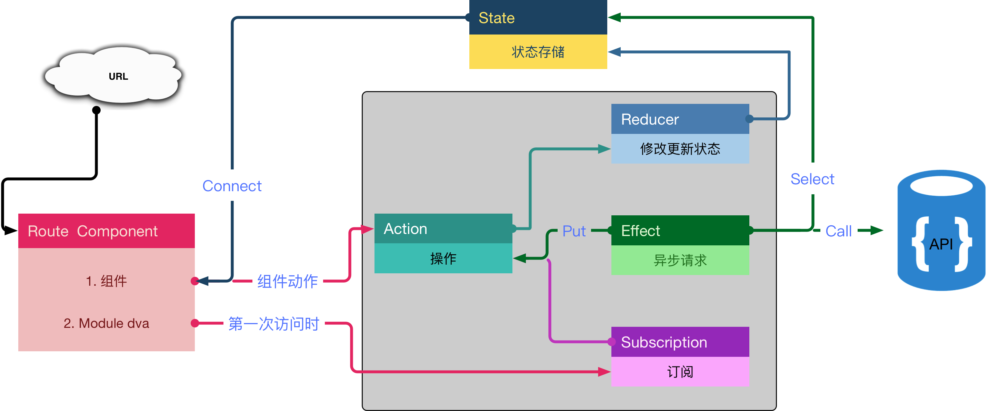

# Dva 数据获取的流程分析


## 原理架构图 (重新绘制)




根据官方提供的dva原理的基础, 并结合我们现在使用的构架进行重新绘制.


## 数据获取流程

我们构架是如何获取数据的呢? 我们下面会以获取用户列表为例子, 我们将走一边这个流程.


### 路由器
先从路由文件开始, 下面是部分代码. 将指定 `models` 文件和 `component` 文件.

```js
const routes = [
    {
        path: '/agent/list',
        models: () => [import('../models/agent/list')],
        component: () => import('../views/agent/list/'),
    },
    ...
]

module.exports.routes = routes;
```

去渲染 `component` 组件页面, 并没有数据, 会出正在加载数据的提示信息. `models` 并执行去获取数据信息.

### Dva

现在我们看一下 `models` 是怎么样获取数据信息的. 首先它会执行 `subscriptions` 里的函数类似于进行数据初始化操作. `subscriptions` 再去调用 `Effects` 进行异步请求数据. dva的实现是用 `fork` 创建一个新的 `task` 进行数据请求操作. 数据请求完成后, 会调用 `reducers` 来将数据返回给 `component`.

来看一下 `models` 的代码:

```js
/* global window */
import modelExtend from 'dva-model-extend'
import queryString from 'query-string'
import { config } from 'utils'
import { create, remove, update } from 'server/user'
import * as agentService from 'server/agentList'
import { pageModel } from '../common'

const { agentLists, changeStatue, del } = agentService
const { prefix } = config

export default modelExtend(pageModel, {
  namespace: 'agentList',

  state: {
  },

  subscriptions: {
    setup ({ dispatch, history }) {
        console.log("111111", history);
      history.listen((location) => {
        if (location.pathname === '/agent/list') {
          const payload = queryString.parse(location.search) || { page: 1, pageSize: 10 }
          dispatch({
            type: 'query',
            payload,
          })
        }
      })
    },
  },

  effects: {

    * query ({ payload = {} }, { call, put }) {
      const {code,data} = yield call(agentLists, payload)
      console.log(data);
      console.log("afasfdsfafasdfasd");
      if (code === 200) {
        yield put({
          type: 'querySuccess',
          payload: {
            list: data.list,
            pagination: {
              current: Number(payload.page) || 1,
              pageSize: Number(payload.pageSize) || 20,
              total: data.total,
            },
          },
        })
      }
    },

    * delete ({ payload }, { call, put, select }) {
      const data = yield call(del, { id: payload })
      if (data.data.success) {
        yield put({ type: 'updateState', payload: { selectedRowKeys: payload } })
      } else {
        throw data
      }
    },

  },

  reducers: {
    tigglePrompt ( state, { payload }) {
        return { ...state, promptValue: payload }
    },

    querySuccess (state, { payload }) {
        const { list, pagination } = payload
            return {
                ...state,
                list,
                pagination: {
                ...state.pagination,
                ...pagination,
                },
            }
        },
    },

  },
})

```


### 异步请求数据
现在, 我们要回顾一下怎么发起向后端的异步请求. 我们这里使用的 `axios` 发起 `GET` / `POST` 请求. 请下面我们来看一下代码.

```js

```


1. router
2. model
    1. subscription
    2. call
    3. axios
    5. effect
    6. reducer
3. connect component
